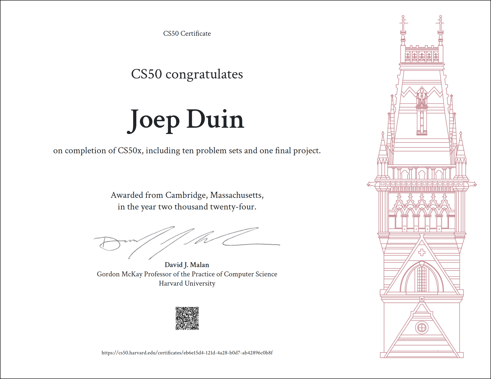

# CS50's Introduction to Computer Science

## CS50x - 2024

[General Information](https://www.edx.org/learn/computer-science/harvard-university-cs50-s-introduction-to-computer-science))

[CS50: Introduction to Computer Science](https://cs50.harvard.edu/x/2024/)

[CS50 Certificate](https://cs50.harvard.edu/x/2024/certificate/)

## Course description
This is CS50x , Harvard University's introduction to the intellectual enterprises of computer science and the art of programming for majors and non-majors alike, with or without prior programming experience. An entry-level course taught by David J. Malan, CS50x teaches students how to think algorithmically and solve problems efficiently. Problem sets inspired by real-world domains of biology, cryptography, finance, forensics, and gaming. The on-campus version of CS50x , CS50, is Harvard's largest course. 

## Topics
Abstraction, algorithms, data structures, encapsulation, resource management, security, software engineering, and web development. 

## Languages
C, Python, SQL, JavaScript, CSS, HTML

## Objectives
* A broad and robust understanding of computer science and programming

* How to think algorithmically and solve programming problems efficiently

* Concepts like abstraction, algorithms, data structures, encapsulation, resource management, security, software engineering, and web development

* Familiarity with a number of languages, including C, Python, SQL, and JavaScript plus CSS and HTML

* How to engage with a vibrant community of like-minded learners from all levels of experience

* How to develop and present a final programming project to your peers

*Please note that this repository is for storing my projects and files from Harvard University's CS50x course. It is not meant for sharing answers or encouraging academic dishonesty. If you are currently enrolled, please complete the assignments independently and refer to the course materials.*

